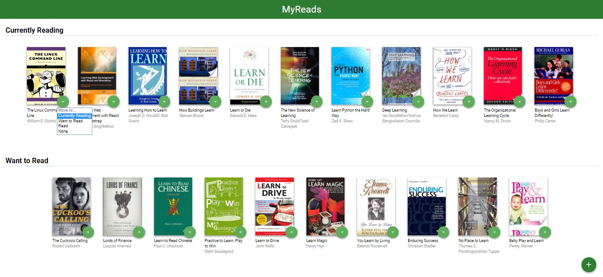
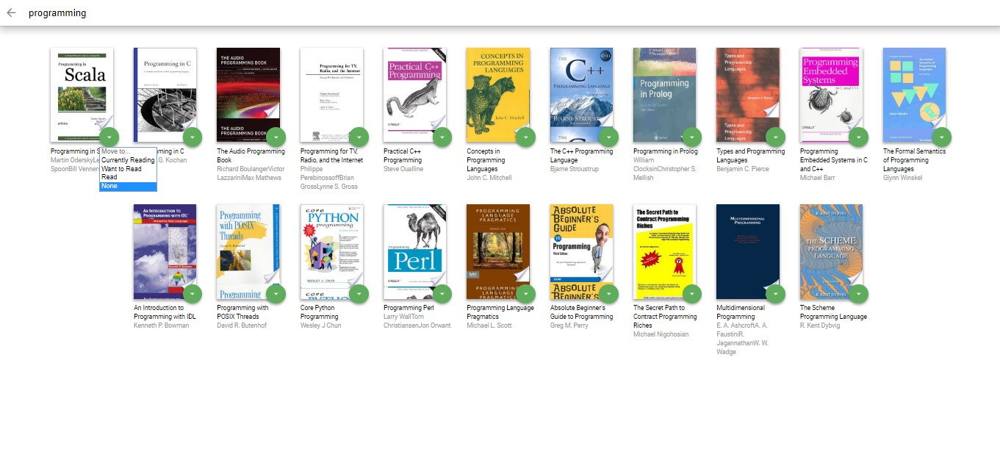

# MyReads Project

This is the project for Udacity's Front-End Web Developer Nanodegree. It is based on the static example of the CSS and HTML markup. The starter code is also provided with the backend server [`BooksAPI.js`] to develop against. The main goal of the project is to add interactivity to the app by refactoring the static code in this template using React API.

## Get Started

* clone this repository
* install all project dependencies with `npm install`
* start the development server with `npm start`

## Project Details:

1. **The main page:**  
1.1. shows 3 shelves for books: 'Currently reading', 'Want to read', 'Read' and each book is shown on the shelf chosen;   
1.2. shows a control that allows users to move books between shelves. 

2. **The search page:**  
2.1. as the user types into the search field, books that match the query are displayed on the page;  
2.2. invalid queries are handled and prior search results are not shown;  
2.3. search results on the search page allow the user to select “currently reading”, “want to read”, or “read” to place the book in a certain shelf;  
2.4. information about the shelf in consistent on both: main and search pages;  
2.5. when an item is categorized on the search page and the user navigates to the main page, it appears on that shelf in the main page.

## Important

The backend API uses a fixed set of cached search results and is limited to a particular set of search terms, which can be found in [SEARCH_TERMS.md](SEARCH_TERMS.md). That list of terms are the _only_ terms that will work with the backend, so don't be surprised if your searches for Basket Weaving or Bubble Wrap don't come back with any results.

